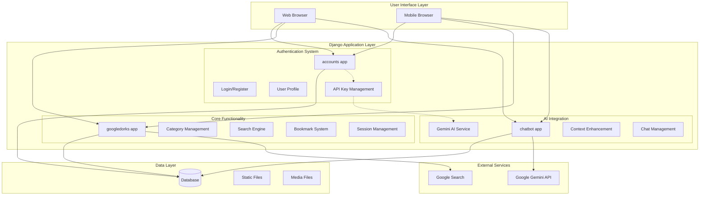
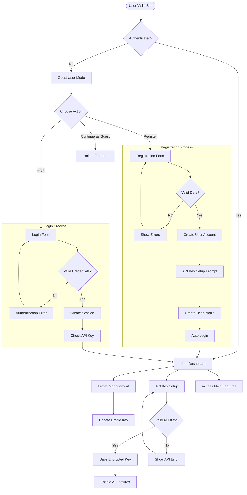
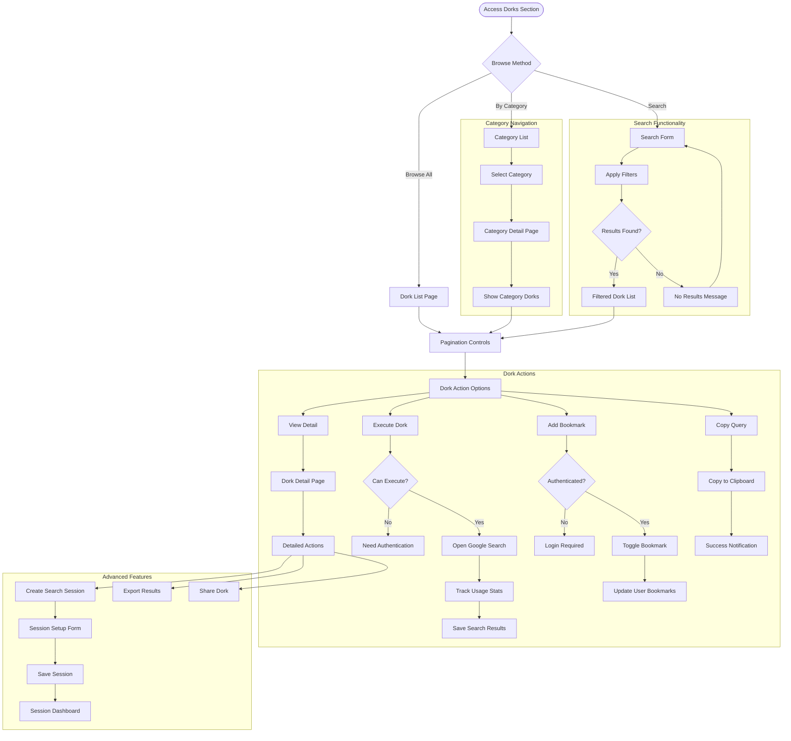
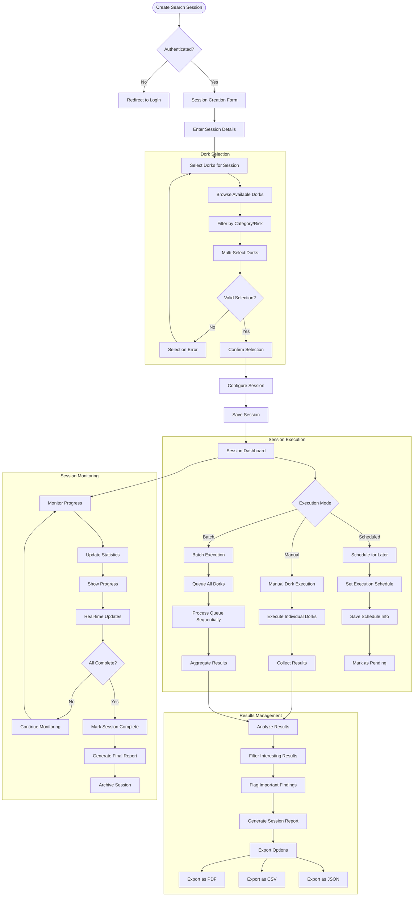
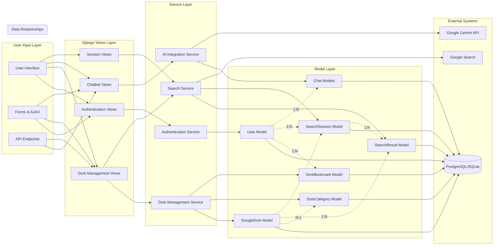
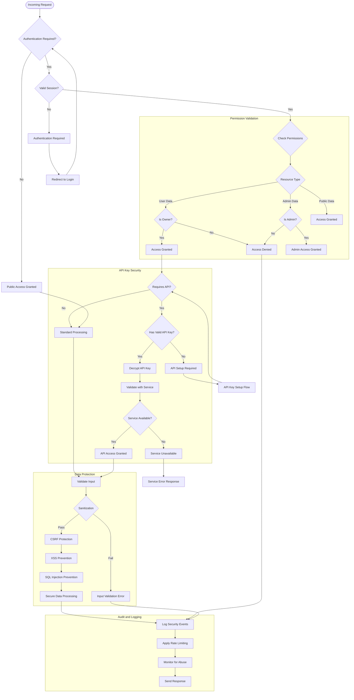
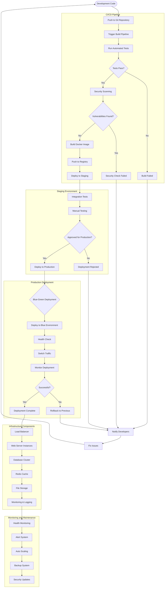
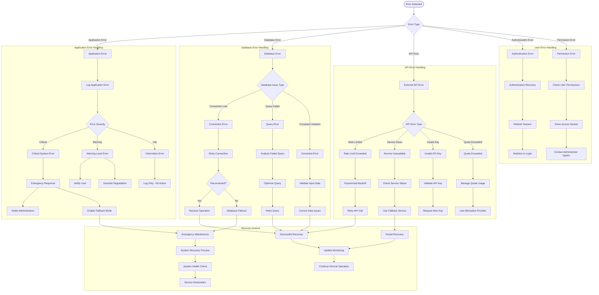

# PROJECT WORKFLOW DIAGRAMS

## AI-Enhanced Google Dorks Toolkit - Complete System Workflows

This document contains comprehensive Mermaid diagrams representing all major workflows in the Google Dorks Toolkit project.

---

## 1. OVERALL SYSTEM ARCHITECTURE

---

## 2. USER AUTHENTICATION WORKFLOW

---

## 3. GOOGLE DORKS MANAGEMENT WORKFLOW

---

## 4. AI CHATBOT INTERACTION WORKFLOW

```mermaid
flowchart TD
    Chat_Start([Access AI Chatbot]) --> Auth_Status{User Status}
    
    Auth_Status -->|Anonymous| Anonymous_Chat[Anonymous Chat Mode]
    Auth_Status -->|Authenticated| Check_API{Has API Key?}
    
    Check_API -->|No| API_Setup_Prompt[API Key Setup Prompt]
    Check_API -->|Yes| Full_Chat[Full AI Chat Mode]
    
    API_Setup_Prompt --> Setup_Guide[Show Setup Guide]
    Setup_Guide --> External_Setup[Google AI Studio Setup]
    External_Setup --> Return_API[Return with API Key]
    Return_API --> Validate_Key{Valid Key?}
    Validate_Key -->|No| Key_Error[Invalid Key Error]
    Validate_Key -->|Yes| Save_Key[Save Encrypted Key]
    Key_Error --> Setup_Guide
    Save_Key --> Full_Chat
    
    Anonymous_Chat --> Limited_Features[Limited AI Features]
    Full_Chat --> Load_Sessions[Load Chat Sessions]
    
    subgraph "Chat Session Management"
        Load_Sessions --> Session_Choice{Session Action}
        Session_Choice -->|New Chat| Create_New[Create New Session]
        Session_Choice -->|Continue| Load_Existing[Load Existing Session]
        Session_Choice -->|History| View_History[View Chat History]
        
        Create_New --> New_Session[Initialize New Session]
        Load_Existing --> Resume_Chat[Resume Conversation]
        New_Session --> Chat_Interface[Chat Interface]
        Resume_Chat --> Chat_Interface
    end
    
    subgraph "Message Processing"
        Chat_Interface --> User_Input[User Types Message]
        User_Input --> Validate_Input{Valid Input?}
        Validate_Input -->|No| Input_Error[Input Validation Error]
        Validate_Input -->|Yes| Save_User_Msg[Save User Message]
        
        Save_User_Msg --> Context_Building[Build Context]
        Context_Building --> Extract_Keywords[Extract Keywords]
        Extract_Keywords --> Search_Dorks[Search Relevant Dorks]
        Search_Dorks --> Load_History[Load Conversation History]
        Load_History --> Build_Prompt[Build AI Prompt]
        
        Build_Prompt --> Call_API[Call Gemini API]
        Call_API --> API_Response{API Success?}
        API_Response -->|No| Fallback[Fallback Response]
        API_Response -->|Yes| Process_Response[Process AI Response]
        
        Fallback --> Save_Bot_Msg[Save Bot Message]
        Process_Response --> Enhance_Response[Enhance with Context]
        Enhance_Response --> Add_Recommendations[Add Dork Recommendations]
        Add_Recommendations --> Save_Bot_Msg
        
        Save_Bot_Msg --> Update_UI[Update Chat UI]
        Update_UI --> Show_Feedback[Show Feedback Options]
    end
    
    subgraph "Feedback System"
        Show_Feedback --> User_Feedback{User Feedback?}
        User_Feedback -->|Thumbs Up| Positive_Feedback[Record Positive]
        User_Feedback -->|Thumbs Down| Negative_Feedback[Record Negative]
        User_Feedback -->|Report| Report_Issue[Report Problem]
        User_Feedback -->|None| Continue_Chat[Continue Chat]
        
        Positive_Feedback --> Update_Metrics[Update Metrics]
        Negative_Feedback --> Update_Metrics
        Report_Issue --> Admin_Notification[Notify Admins]
        Update_Metrics --> Continue_Chat
        Admin_Notification --> Continue_Chat
    end
    
    Continue_Chat --> Chat_Interface
    Input_Error --> Chat_Interface
    Limited_Features --> Basic_Chat[Basic Chat Interface]
    Basic_Chat --> Static_Response[Static Responses Only]
```

---

## 5. SEARCH SESSION WORKFLOW

---

## 6. DATA FLOW AND DATABASE INTERACTIONS

---

## 7. SECURITY AND PERMISSION WORKFLOW

---

## 8. DEPLOYMENT AND INFRASTRUCTURE WORKFLOW

---

## 9. ADMIN AND MANAGEMENT WORKFLOW

```mermaid
flowchart TD
    Admin_Access([Admin Login]) --> Admin_Dashboard[Admin Dashboard]
    
    subgraph "User Management"
        Admin_Dashboard --> User_Mgmt[User Management]
        User_Mgmt --> View_Users[View All Users]
        View_Users --> User_Actions{User Actions}
        
        User_Actions -->|Edit| Edit_User[Edit User Details]
        User_Actions -->|Deactivate| Deactivate_User[Deactivate Account]
        User_Actions -->|Reset Password| Reset_Password[Reset User Password]
        User_Actions -->|View Activity| User_Activity[View User Activity]
        
        Edit_User --> Save_Changes[Save User Changes]
        Deactivate_User --> Confirm_Deactivation[Confirm Deactivation]
        Reset_Password --> Generate_Token[Generate Reset Token]
        User_Activity --> Activity_Report[Generate Activity Report]
    end
    
    subgraph "Content Management"
        Admin_Dashboard --> Content_Mgmt[Content Management]
        Content_Mgmt --> Dork_Management[Manage Dorks]
        Content_Mgmt --> Category_Management[Manage Categories]
        
        Dork_Management --> Dork_Actions{Dork Actions}
        Dork_Actions -->|Add| Add_Dork[Add New Dork]
        Dork_Actions -->|Edit| Edit_Dork[Edit Existing Dork]
        Dork_Actions -->|Delete| Delete_Dork[Delete Dork]
        Dork_Actions -->|Verify| Verify_Dork[Verify Dork Quality]
        
        Category_Management --> Category_Actions{Category Actions}
        Category_Actions -->|Add| Add_Category[Add New Category]
        Category_Actions -->|Edit| Edit_Category[Edit Category]
        Category_Actions -->|Reorganize| Reorganize_Categories[Reorganize Structure]
    end
    
    subgraph "System Monitoring"
        Admin_Dashboard --> System_Monitor[System Monitoring]
        System_Monitor --> Performance_Metrics[Performance Metrics]
        System_Monitor --> Usage_Analytics[Usage Analytics]
        System_Monitor --> Error_Logs[Error Logs]
        System_Monitor --> Security_Events[Security Events]
        
        Performance_Metrics --> Resource_Usage[CPU/Memory Usage]
        Performance_Metrics --> Response_Times[Response Time Analysis]
        Performance_Metrics --> Database_Performance[Database Performance]
        
        Usage_Analytics --> User_Statistics[User Statistics]
        Usage_Analytics --> Feature_Usage[Feature Usage Stats]
        Usage_Analytics --> Popular_Dorks[Popular Dorks Analysis]
        
        Error_Logs --> Critical_Errors[Critical Errors]
        Error_Logs --> Application_Errors[Application Errors]
        Error_Logs --> API_Errors[API Error Analysis]
        
        Security_Events --> Failed_Logins[Failed Login Attempts]
        Security_Events --> Suspicious_Activity[Suspicious Activity]
        Security_Events --> API_Abuse[API Abuse Detection]
    end
    
    subgraph "Maintenance Tasks"
        Admin_Dashboard --> Maintenance[System Maintenance]
        Maintenance --> Database_Maintenance[Database Maintenance]
        Maintenance --> Cache_Management[Cache Management]
        Maintenance --> Backup_Management[Backup Management]
        
        Database_Maintenance --> Optimize_DB[Optimize Database]
        Database_Maintenance --> Clean_Old_Data[Clean Old Data]
        Database_Maintenance --> Index_Maintenance[Index Maintenance]
        
        Cache_Management --> Clear_Cache[Clear Cache]
        Cache_Management --> Cache_Statistics[Cache Statistics]
        
        Backup_Management --> Create_Backup[Create Manual Backup]
        Backup_Management --> Restore_Backup[Restore from Backup]
        Backup_Management --> Backup_Schedule[Manage Backup Schedule]
    end
    
    subgraph "Configuration Management"
        Admin_Dashboard --> Config_Mgmt[Configuration Management]
        Config_Mgmt --> System_Settings[System Settings]
        Config_Mgmt --> API_Configuration[API Configuration]
        Config_Mgmt --> Security_Settings[Security Settings]
        
        System_Settings --> General_Config[General Configuration]
        System_Settings --> Feature_Flags[Feature Flags]
        
        API_Configuration --> Rate_Limits[API Rate Limits]
        API_Configuration --> Service_Keys[Service Key Management]
        
        Security_Settings --> Auth_Settings[Authentication Settings]
        Security_Settings --> Permission_Config[Permission Configuration]
    end
```

---

## 10. ERROR HANDLING AND RECOVERY WORKFLOW

---

This comprehensive set of Mermaid diagrams covers all major workflows in the AI-Enhanced Google Dorks Toolkit project, from user authentication and core functionality to deployment and error handling. Each diagram can be rendered using Mermaid.js in documentation tools, IDEs, or online Mermaid editors.